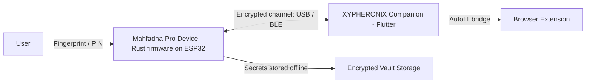

<div align="center">

# XYPHERONIX

### منصة أمان عتادية بمبدأ انعدام الثقة ومعزولة عن الشبكة


[English](README.md) | **العربية**

</div>

---

## نظرة عامة

**XYPHERONIX** منصة أمان عتادية تحمي بيانات اعتمادك وأسرارك بثقة على مستوى العتاد. الجهاز الرئيسي **Mahfadha-Pro** خزنة عتادية معزولة عن الشبكة: تُولّد أسرارك وتُخزّن داخل جهاز آمن مخصص ولا توجد أبداً بشكل غير محمي على حاسوب متصل بالشبكة.

كل شيء مبني على مبدأ واحد: **انعدام الثقة**. يُعامَل الحاسوب المضيف كطرف غير موثوق، والجهاز هو جذر الثقة الوحيد.

## أبرز الميزات

- **معزول عن الشبكة بالتصميم** الأسرار لا تغادر الجهاز دون تشفير.
- **فتح بالبصمة** مصادقة حيوية مع إغلاق صارم بعد المحاولات الفاشلة المتكررة.
- **تشفير عسكري** خوارزمية AES-256-GCM مع اشتقاق مفاتيح PBKDF2.
- **آلة حالات آمنة قابلة للتحقق** كل انتقال بين الحالات صريح ويجري التحقق منه.
- **كشف العبث** أحداث العبث المادي تؤدي إلى الإغلاق وتسجيل تدقيقي.
- **تحديد المعدل ومقاومة هجمات الإغراق** تُقيّد محاولات المصادقة على مستوى العتاد.
- **تطبيق مرافق متعدد المنصات** تطبيق سطح المكتب والهاتف للاقتران والنقل المشفّر.

## البنية



## نموذج الأمان

| الطبقة | الآلية |
| --- | --- |
| المصادقة | مستشعر بصمة مع إغلاق بعد المحاولات الفاشلة المتكررة |
| التشفير | AES-256-GCM لبيانات الخزنة والنقل |
| اشتقاق المفاتيح | PBKDF2 |
| السلامة | التحقق بـ SHA-256 للتحديثات والبيانات المخزّنة |
| الصمود | مراقب التشغيل، كشف العبث، إعادة ضبط آمنة، سجل تدقيق |
| حدود الثقة | الحاسوب المضيف غير موثوق، والجهاز هو جذر الثقة الوحيد |

## هيكل المستودع

| المسار | الوصف |
| --- | --- |
| `app/` | تطبيق Flutter المرافق (سطح المكتب والهاتف) |
| `firmware/` | مرجع برنامج الجهاز الثابت |
| `cli-bridge/` | جسر اتصال تسلسلي مع المضيف |
| `installer/` | إعداد مثبّت ويندوز |
| `.github/workflows/` | خط التكامل والإصدار |

> برنامج الجهاز الإنتاجي يوجد في المستودع المخصص **Xypheronix-Mahfadha-Pro** (لغة Rust، ESP32).

## البدء

```bash
# تشغيل التطبيق المرافق (وضع التطوير)
cd app
flutter pub get
flutter run -d windows

# البناء للإنتاج
flutter build windows --release

# إصدار نسخة جديدة
git tag v3.1.4
git push origin v3.1.4
```

## الإصدار وإدارة النسخ

عند نشر نسخة جديدة، حدّث رقم الإصدار في:

- `app/pubspec.yaml`
- قسم "حول التطبيق" داخل التطبيق
- `installer/setup.iss`

ثم ادفع وسماً مطابقاً بالصيغة `v*` لتشغيل خط الإصدار الذي ينشر مثبّت ويندوز وملف بيان التحديث.

## تنبيه أمني

لا يوجد **باب خلفي مطلقاً**. إذا دُمّر الجهاز دون نسخة احتياطية صالحة، فالبيانات غير قابلة للاسترداد رياضياً. حافظ على رمزك السري ونسختك الاحتياطية.

## الرخصة

صادر تحت رخصة MIT.

---

<div align="center">

**XYPHERONIX** أمان تمسكه بيدك.

</div>
