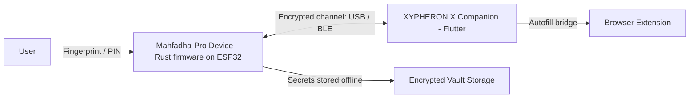

<div align="center">

# XYPHERONIX


### منصة أمان عتادية بمبدأ انعدام الثقة ومعزولة عن الشبكة


[English](README.md) | **العربية**

</div>

---

## نظرة عامة

**XYPHERONIX** منصة أمان عتادية تحمي بيانات اعتمادك وأسرارك بثقة على مستوى العتاد. الجهاز الرئيسي **Mahfadha-Pro** خزنة عتادية معزولة عن الشبكة: تُولَّد أسرارك وتُخزَّن داخل جهاز آمن مخصص ولا توجد أبداً بشكل غير محمي على حاسوب متصل بالشبكة.

كل شيء مبني على مبدأ واحد: **انعدام الثقة**. يُعامَل الحاسوب المضيف كطرف غير موثوق، والجهاز هو جذر الثقة الوحيد.

## أبرز الميزات

- **معزول عن الشبكة بالتصميم** الأسرار لا تغادر الجهاز دون تشفير.
- **فتح بالبصمة** مصادقة ببصمة الإصبع مع إغلاق صارم بعد تكرار المحاولات الفاشلة.
- **تشفير عسكري** تشفير AES-256-GCM مع اشتقاق مفاتيح PBKDF2.
- **آلة حالات آمنة قابلة للتحقق** كل انتقال بين الحالات صريح ومُتحقَّق منه.
- **كشف العبث** أحداث العبث المادي تُفعّل الإغلاق وتسجيل التدقيق.
- **تحديد المعدل ومقاومة الإغراق** محاولات المصادقة مضبوطة على مستوى البرمجيات الثابتة.
- **تطبيق مرافق متعدد المنصات** تطبيق سطح مكتب وجوال للاقتران والنقل المشفّر.

## البنية



## نموذج الأمان

| الطبقة | الآلية |
| --- | --- |
| المصادقة | مستشعر بصمة مع إغلاق بعد تكرار المحاولات الفاشلة |
| التشفير | AES-256-GCM لبيانات الخزنة والنقل |
| اشتقاق المفاتيح | PBKDF2 |
| السلامة | تحقق SHA-256 للتحديثات والبيانات المخزّنة |
| الصلابة | مراقب (Watchdog)، كشف العبث، إعادة ضبط آمنة، سجل تدقيق |
| حدود الثقة | المضيف غير موثوق، والجهاز هو جذر الثقة الوحيد |

## هيكل المستودع

| المسار | الوصف |
| --- | --- |
| `app/` | تطبيق Flutter المرافق (سطح مكتب وجوال) |
| `firmware/` | مرجع برمجيات الجهاز |
| `cli-bridge/` | جسر تواصل تسلسلي مع المضيف |
| `installer/` | إعداد مثبّت ويندوز |
| `.github/workflows/` | خط التكامل والإصدار |

> برمجيات الجهاز الإنتاجية موجودة في المستودع المخصص **Xypheronix-Mahfadha-Pro** (بلغة Rust على ESP32).

## البدء

```bash
# تشغيل التطبيق المرافق (تطوير)
cd app
flutter pub get
flutter run -d windows

# بناء للإنتاج
flutter build windows --release

# إصدار نسخة جديدة
git tag v3.1.4
git push origin v3.1.4
```

## الإصدار وإدارة النسخ

عند إصدار نسخة جديدة، حدّث رقم الإصدار في:

- `app/pubspec.yaml`
- قسم "حول التطبيق" داخل التطبيق
- `installer/setup.iss`

ثم ادفع وسماً (tag) بصيغة `v*` لتشغيل خط الإصدار الذي ينشر مثبّت ويندوز وملف بيان التحديث.

## تنبيه أمني

**لا يوجد باب خلفي مطلقاً**. إذا دُمّر الجهاز دون نسخة احتياطية صالحة، فإن البيانات غير قابلة للاسترداد رياضياً. حافظ على رقمك السري ونسختك الاحتياطية.

## الرخصة

صادر برخصة MIT.

---

<div align="center">

**XYPHERONIX** أمان تمسكه بيدك.

</div>
