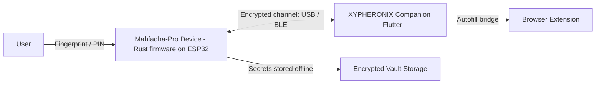

<div align="center">

# XYPHERONIX

### Zero-Trust, Air-Gapped Hardware Security Platform


**English** | [العربية](README.ar.md)

</div>

---

## Overview

**XYPHERONIX** is a hardware security platform that protects your credentials and secrets with device-grade trust. The flagship device, **Mahfadha-Pro**, is an air-gapped hardware vault: your secrets are generated and stored on a dedicated secure device and never live unprotected on a networked computer.

Everything is built around a single principle: **zero trust**. The host computer is treated as untrusted, and the device is the only root of trust.

## Key Features

- **Air-gapped by design** secrets never leave the device unencrypted.
- **Biometric unlock** fingerprint authentication with strict lockout after repeated failures.
- **Military-grade cryptography** AES-256-GCM encryption with PBKDF2 key derivation.
- **Verifiable secure state machine** every state transition is explicit and validated.
- **Tamper detection** physical tamper events trigger lockout and audit logging.
- **Rate limiting and anti-DDoS** authentication attempts are throttled at the firmware level.
- **Cross-platform companion** desktop and mobile app for pairing and encrypted transfer.

## Architecture



## Security Model

| Layer | Mechanism |
| --- | --- |
| Authentication | Fingerprint sensor with lockout after repeated failures |
| Encryption | AES-256-GCM for vault data and transport |
| Key derivation | PBKDF2 |
| Integrity | SHA-256 verification of updates and stored data |
| Resilience | Watchdog, tamper detection, secure reset, audit log |
| Trust boundary | Host treated as untrusted, device is the only root of trust |

## Repository Layout

| Path | Description |
| --- | --- |
| `app/` | Flutter companion application (desktop and mobile) |
| `firmware/` | Device firmware reference |
| `cli-bridge/` | Serial bridge for host communication |
| `installer/` | Windows installer configuration |
| `.github/workflows/` | CI and release pipeline |

> The production device firmware lives in the dedicated repository **Xypheronix-Mahfadha-Pro** (Rust, ESP32).

## Getting Started

```bash
# Run the companion app (development)
cd app
flutter pub get
flutter run -d windows

# Build for production
flutter build windows --release

# Cut a release
git tag v3.1.4
git push origin v3.1.4
```

## Release and Versioning

When publishing a new version, update the version string in:

- `app/pubspec.yaml`
- the in-app About section
- `installer/setup.iss`

Then push a matching `v*` tag to trigger the release pipeline, which publishes the Windows installer and update manifest.

## Security Notice

There is **no backdoor**. If the device is destroyed without a valid backup, the data is mathematically unrecoverable. Keep your PIN and your backup safe.

## License

Released under the MIT License.

---

<div align="center">

**XYPHERONIX** security you can hold in your hand.

</div>
